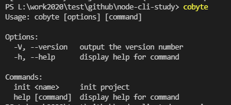

# node-cli-study
node cli工具实现


先初始化

```
npm ini -y
```

然后新建目录bin，在bin目录下新建一个index.js文件，这个文件到时是作为一个shell文件进行执行的，需要在文件开头加一行：

```
#!/usr/bin/env node
```

这段代码的意思是指定脚本解析器类型，本来shell环境只能执行B-shell文件，如果要执行JavaScript文件则需要指定解析器为node。

配置package.json文件

```javascript
{
  "bin": {
    "cobyte": "./bin/cobyte.js"
  },
}
```

这个配置的意思是说，这个指令名称是`cobyte` 运行之后执行的是`"./bin/cobyte.js"` 这个文件的代码

本地虚拟挂载

```
#将npm 模块链接到对应的运行项目中去
npm link
```

然后就可以执行`cobyte`命令了。

定制命令行界面

```
// 先安装依赖
npm i commander download-git-repo ora handlebars figlet clear chalk open watch -S
```

在`"./bin/cobyte.js"` 这个文件的继续写上：

```javascript
import program from 'commander'
program.version('1.0.0')
program.command('init <name>')
    .description('init project')
    .action(name => {
        console.log('init:', name)
    })
program.parse(process.argv)
```

再执行cobyte命令看看结果：

 

然后我们可以继续输入其他命令进行查看结果

```
cobyte -V
cobyte init aaa
```

