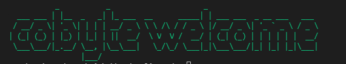
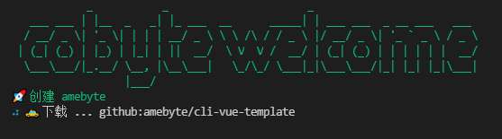
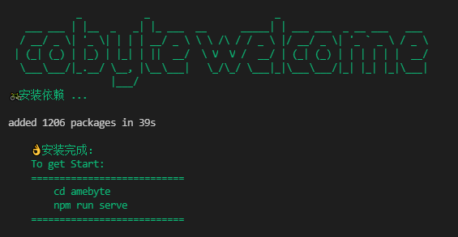

# node-cli-study
node cli工具实现


先初始化

```
npm ini -y
```

然后新建目录bin，在bin目录下新建一个index.js文件，这个文件到时是作为一个shell文件进行执行的，需要在文件开头加一行：

```
#!/usr/bin/env node
```

这段代码的意思是指定脚本解析器类型，本来shell环境只能执行B-shell文件，如果要执行JavaScript文件则需要指定解析器为node。

配置package.json文件

```javascript
{
  "bin": {
    "cobyte": "./bin/cobyte.js"
  },
}
```

这个配置的意思是说，这个指令名称是`cobyte` 运行之后执行的是`"./bin/cobyte.js"` 这个文件的代码

本地虚拟挂载

```
#将npm 模块链接到对应的运行项目中去
npm link
```

然后就可以执行`cobyte`命令了。

定制命令行界面

```
// 先安装依赖
npm i commander download-git-repo ora handlebars figlet clear chalk open watch -S
```

在`"./bin/cobyte.js"` 这个文件的继续写上：

```javascript
import program from 'commander'
program.version('1.0.0')
program.command('init <name>')
    .description('init project')
    .action(name => {
        console.log('init:', name)
    })
program.parse(process.argv)
```

再执行cobyte命令看看结果：

 

然后我们可以继续输入其他命令进行查看结果

```
cobyte -V
cobyte init aaa
```

编写欢迎界面

```javascript
import figlet from 'figlet'
import clear from 'clear'
import chalk from 'chalk'

const log = content => console.log(chalk.green(content))
export default async name => {
    // 打印欢迎界面
    clear() // 清屏
    log(figlet.textSync('cobyte welcome'))
}
```

 

然后就可以输出上面的界面了，虽然是一些表面工作，但会给我们很好的仪式感。

编写下载模板函数

```javascript
import {promisify} from 'util'
import download from 'download-git-repo'
import ora from 'ora'

export default async function (repo, desc) {
    const down = promisify(download)
    const process = ora(`🚕 下载 ... ${repo}`)
    // 显示进度条
    process.start()
    await down(repo, desc)
    process.succeed()
}
```

然后在init里面进行下载

```javascript
// 下载空模版
log(`🚀 创建 ${name}`)
await download('github:amebyte/cli-vue-template', name)
```

 

执行命令会出现以上界面

安装依赖 

安装依赖需要运行命令，需要用到没`spawn` 

重新`spawn` 为 `Promise` 风格函数

```javascript
const spawnPromise = async (...args) => {
    return new Promise(resolve => {
        const child = spawn(...args)

        // 输出流
        child.stdout.pipe(process.stdout)
        child.stderr.pipe(process.stderr)
        child.on('close', () => {
            resolve()
        })
    })
}
```

注意：windows下npm执行名不同 

```javascript
log('🚲安装依赖 ...')
const npms = process.platform === "win32" ? "npm.cmd" : "npm"
await spawnPromise(npms, ['install'], {cwd: `./${name}`})
log(`
👌安装完成：
To get Start:
===========================
cd ${name}
npm run serve
===========================
`);
```

然后执行命令出现一下界面

 

自动打开浏览器

```
// 自动打开浏览器
open('http://localhost:8080')
```

自动运行调试环境 

```
//自动运行调试环境
await spawnPromise(npms, ['run', 'serve'], {cwd: `./${name}`})
```

